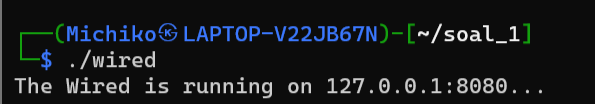
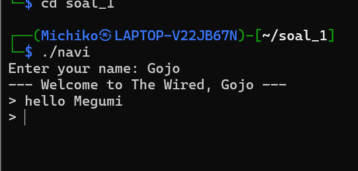
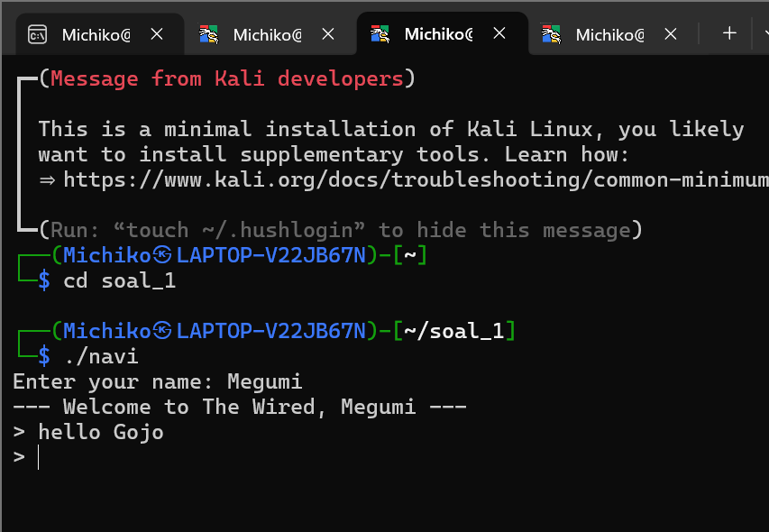
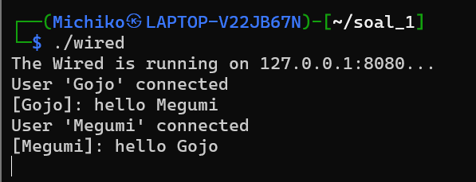
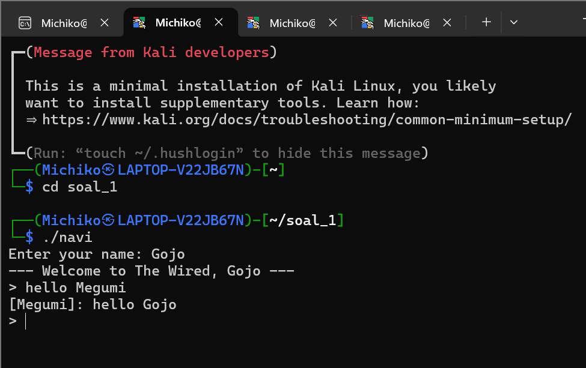
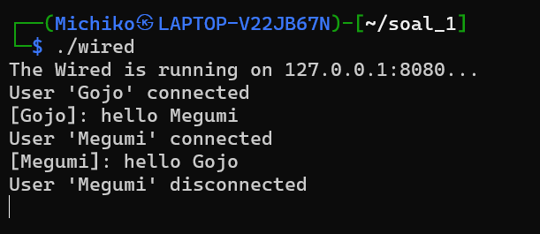
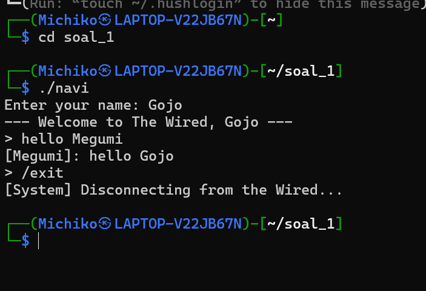
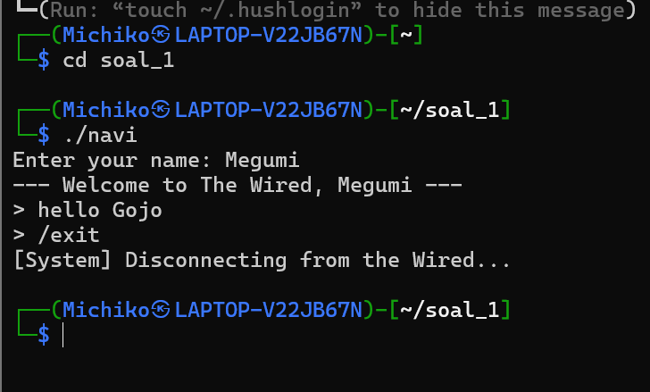
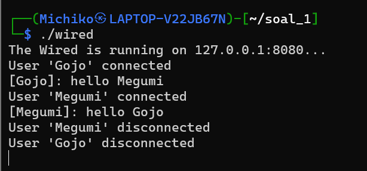

# SISOP-3-2026-IT-105

## Soal 1
### 1. Pengerjaan file ```protocol.h``` (header)
File ini sebagai penyedia struktur data dan fungsi-fungsi global yang digunakan secara bersamaan oleh client (navi.c) dan server (wired.c) agar komunikasi keduanya sinkron. 

```c
#define MAX_BUF 1024
#define MAX_NAME 50
```
Batasan ukuran buffer pesan dan nama user.

```c
typedef struct {
    char sender [MAX_NAME];
    char content [MAX_BUF];
    int type; // login, chat, command, exit.
} Message;
```
Struktur data untuk bertukar informasi antara client dan server. 


```c
static inline void get_config (Config *cfg, const char *filename) {
    FILE *f = fopen(filename, "r");
    if (!f) {
        strcpy(cfg->ip, "127.0.0.1");
        cfg->port = 8080;
        return;
    }

    if (fscanf(f, "%[^:]:%d", cfg->ip, &cfg->port) != 2) {
        strcpy(cfg->ip, "127.0.0.1");
        cfg->port = 8080;
    }
    fclose(f);
}
```
Fungsi untuk membaca pengaturan jaringan dari file ```wired.conf```. Program membuka file tersebut, menggunakan fungsi ```fscanf```. ```%[^:]:%d``` mengambil teks sebelum tanda titik dua sebagai alamat IP dan angka setelahnya sebagai Port. Jika file tidak ditemukan atau formatnya salah, fungsi secara otomatis memberi nilai default ```127.0.0.1``` dengan Port ```8080```.


```c
static inline void log_event (const char *tag, const char *msg) {
    FILE *f = fopen ("history.log", "a");
    if (!f) {
        return;
    }

    time_t now = time(NULL);
    struct tm *t = localtime(&now);
    char ts[25];
    strftime(ts, sizeof(ts), "%Y-%m-%d %H:%M:%S", t);

    fprintf(f, "[%s] %s %s\n", ts, tag, msg);
    fclose(f);
}
```
Fungsi untuk menangani pencatatan aktivitas ke dalam file ```history.log``` dengan mode append (```a```) sehingga data baru tidak menghapus data lama. Fungsi ini mengambil waktu sistem saat ini (```time(NULL)```), mengubahnya ke format yang bisa dibaca (```strftime```), lalu memcatat bersama dengan label (```tag```) dan isi kejadian ke dalam file log. 


### 2. Pengerjaan ```wired.c``` (server)
File ini sebagai pusat jaringan yang mengelola koneksi dari banyak pengguna sekaligus. 

```c
void broadcast (Message msg, int sender_fd) {
    pthread_mutex_lock (&clients_mutex);
    for (int i = 0; i < MAX_CLIENTS; i++) {
        if (clients[i] != NULL && clients[i]->socket != sender_fd) {
            send (clients[i]->socket, &msg, sizeof(msg), 0);
        }
    }
    pthread_mutex_unlock (&clients_mutex);
}
```
Fungsi ini untuk mngatur fitur chat grup. Server akan mengunci data client menggunakan mutex agar aman dari gangguan thread lain, lalu melakukan perulangan untuk mengirimkan pesan (send) kepada setiap pengguna yang sedang terhubung, kecuali kepada orang yang mengirim pesan tersebut agar pesannya tidak muncul dua kali di layar si pengirim.


```c
void *handle_client (void *arg) {
    int client_fd = *((int *)arg);
    free(arg);
    Message msg;
    char log_buf[200];
    char name [MAX_NAME];
    int index = -1;
}
```
Fungsi ini rutin dijalankan oleh setiap thread baru untuk menangani satu client secara spesifik.


```c
if (recv (client_fd, &msg, sizeof(msg), 0) > 0) {
    strcpy (name, msg.sender);
    if (strcmp(name, "The Knights") != 0) {
        pthread_mutex_lock(&clients_mutex);
        for (int i = 0; i < MAX_CLIENTS; i++) {
            if (clients[i] == NULL) {
                clients[i] = malloc(sizeof(Client));
                clients[i]->socket = client_fd;
                strcpy (clients[i]->name, name);
                index = i;
                break;
            }
        }
        pthread_mutex_unlock(&clients_mutex);
        sprintf (log_buf, "User '%s' connected", name);
    }
    else {
        sprintf(log_buf, "Admin 'The Knights' connected");
    }

    log_event ("[System]", log_buf);
    printf ("%s\n", log_buf);
}
```
- Dalam fungsi ```handle_client``` terdapat logika login. Saat client pertama kali terhubung, server menunggu nama pengguna (```recv```). Jika namanya bukan admin (The Knights), server akan mencatat slot kosong di array ```clients```. 
- ```mutex``` melindungi proses pencarian slot agar tidak ada 2 thread yang mengisi slot yang sama secara bersamaan. Setelah tersimpan. server mencatat kejadian di file log. 
- ```else``` ika ```strcmp(name, "The Knights")``` bernilai 0. Server mencatat jika yang terhubung adalah Admin. 
- Server memanggil fungsi pencatat (```log_event```) untuk menyimpan informasi login ke file log dengan label ```[System]```. Lalu server mencetak notifikasi tersebut ke layar terminal. 

```c
// rutinitas chat
while (recv (client_fd, &msg, sizeof(msg), 0) > 0) {
    if (msg.type == 2) {
        char res[100];
        switch (msg.content[0]) {
            case '1': ; // cek usr aktif or no
                int count = 0;
                for (int i = 0; i<MAX_CLIENTS; i++) {
                    if (clients[i]) {
                        count++;
                    }
                }

                sprintf (res, "Active Users: %d", count);
                break;

            case '2': ; // uptime
                sprintf (res, "Server Uptime: %.0f seconds", difftime(time(NULL), start_time));
                break;

            case '3': ; // shutdown
                log_event("[System]", "[EMERGENCY SHUTDOWN INITIATED]");
                printf("Emergency Shutdown by Admin!\n");
                exit (0);
                break;

            default:
                strcpy(res, "Command ignored.");
        }

        strcpy(msg.content, res);
        send (client_fd, &msg, sizeof(msg), 0);
        log_event("[Admin]", res);
        continue;
    }

    if (msg.type == 3 || strcmp (msg.content, "/exit") == 0) {
        break;
    }

    printf ("[%s]: %s\n", msg.sender, msg.content);
    broadcast (msg, client_fd);

    sprintf (log_buf, "[%s]: %s", msg.sender, msg.content);
    log_event ("[User]", log_buf);
}
```
- Server menggunakan ```recv``` dalam perulangan ```while``` untuk terus menerima data selama koneksi client tidak terputus. Jika nilai kembalian >0, artinya ada data baru yang masuk. 
- ```if (msg.type == 2)```: Server cek apakah pesan bertipe command (admin). Jika benar, server masuk ke logika pemrosesan perintah internal:
    - ```case '1'```: server menghitung berapa banyak slot yang tidak kosong untuk mengetahui jumlah user aktif saat ini.
    - ```case '2'```: server menghitung selisih waktu sekarang dengan waktu menyala melalui fungsi ```difftime``` untuk mendapatkan durasi uptime. 
    - ```case '3'```: server mencatat kejadian darurat ke log, mencetak peringatan di terminal, lalu mematikan seluruh program (```exit(0)```).
    - ```send```: hasil perintah admin dikirimkan kembali hanya pada admin yang meminta.
    - ```continue```: kembali ke awal ```while``` tanpa menjalankan kode broadcast di bawahnya (pesan admin bersifat rahasia).
- ```if (msg.type == 3 || strcmp (...) == 0)```: pengecekan sinyal keluar. Jika client mengirim tipe 3 atau mengetik ```/exit```, perulangan dihentikan dengan ```break``` untuk masuk ke tahap pembersihan koneksi (cleanup).
- ```broadcast (msg, client_fd)```: jika pesan bukan perintah admin dan bukan sinyal keluar, akan dianggap sebagai pesan biasa, kemudian disebarluaskan ke seluruh client lain yang terhubung.
- ```log_event ("[User]", log_buf)```: setiap pesan chat yang berhasil diproses akan dicatat secara otomatis ke dalam file log sebagai riwayat komunikasi.

```c
// clean up
close (client_fd);

pthread_mutex_lock(&clients_mutex);
if (index != -1) {
    free (clients[index]);
    clients[index] = NULL;
}

pthread_mutex_unlock(&clients_mutex);

sprintf (log_buf, "User '%s' disconnected", name);
log_event ("[System]", log_buf);
printf ("%s\n", log_buf);

pthread_detach (pthread_self());
return NULL;
```
- Menutup file descriptor socket milik client (```close (client_fd)```). Memutus jalur komunikasi secara fisik dan membebaskan sumber daya kernel yang digunakan oleh socket tersebut. 
- Sebelum mengubah daftar client, server mengunci mutex (```pthread_mutex_lock (&clients_mutex)```). Karena mungkin ada thread lain yang sedang melakukan broadcasr atau ada user baru yang login, sehingga daftar client tidak boleh berubah di saat yang bersamaan. 
- Server mengecek apakah user tersebut terdaftar dalam array (```(index != -1)```). Kemudian dalam logika ```if``` tersebut, memoru yang sebelumnya dialokasikan menggunakan ```malloc``` dihapus menggunakan ```free```. Alamatnya dikosongkan (```NULL```) agar slot dianggap kosong dan bisa digunakan oleh user baru yang akan login nanti. 
- ```mutex``` di unlock agar thread lain bisa kembali mengakses daftar client. 
- Server mencatat kejadian diskoneksi ke dalam history.log.
- ```pthread_detach (pthread_self()```: karena thread sudah selesai tugasnya, ```pthread_detach``` memberitahu sistem operasi untuk membersihkan semua sumber daya thread tersebut segera setelah fungsi ini selesai. 


```c
int main() {
    int server_fd, new_fd;
    struct sockaddr_in server_addr;
    Config cfg;

    start_time = time(NULL);
    get_config (&cfg, "wired.conf");

    server_fd = socket (AF_INET, SOCK_STREAM, 0);
    server_addr.sin_family = AF_INET;
    server_addr.sin_addr.s_addr = inet_addr(cfg.ip);
    server_addr.sin_port = htons (cfg.port);

    bind (server_fd, (struct sockaddr *)&server_addr, sizeof(server_addr));
    listen (server_fd, 10);

    log_event ("[System]", "[SERVER ONLINE]");
    printf ("The Wired is running on %s:%d...\n", cfg.ip, cfg.port);

    while (1) {
        new_fd = accept (server_fd, NULL, NULL);
        pthread_t tid;
        int *new_sock = malloc(sizeof(int));
        *new_sock = new_fd;
        pthread_create (&tid, NULL, &handle_client, new_sock);
    }

    return 0;
}
```
- ```start_time = time(NULL)``` mencatat waktu saat server dijalankan.
- ```get_config``` membaca pengaturan IP dan Port dari file eksternal.
- ```socket(AF_INET, SOCK_STREAM, 0)``` membuka pintu komunikasi (socket) menggunakan protokol IPv4 dan TCP agar pengiriman data stabil.
- Mendaftarkan socket ke alamat IP dan Port yang sudah ditentukan (```bind()```) agar sistem operasi tahu jalur tersebut milik program ini. 
- ```listen(server_fd, 10)``` menginstruksikan server untuk mulai mendengarkan ketukan koneksi dari luar dengan antrean maksimal 10 client.  
- Loop utama server (```while(1)```) agar terus-menerus menerima koneksi baru. 
- ```accept()``` menahan program sampai ada client yang terhubung, lalu membuat socket baru (```new_fd```) khusus untuk komunikasi dengan client tersebut. 
- ```malloc``` mengalokasikan memori untuk menyimpan ID socket client. lalu membuat thread baru (```pthread_create```) agar client ditangani oleh fungsi ```handle_client``` secara mandiri. 

### 3. Pengerjaan ```navi.c``` (client)
```c
//thread dengerin broadcast dri server
void *receive_handler (void *arg) {
    Message msg;
    while (recv (sock_fd, &msg, sizeof(msg), 0) > 0) {
        printf ("\r[%s]: %s\n> ", msg.sender, msg.content);
        fflush (stdout);
    }

    return NULL;
}
```
- Fungsi ```receive_handler``` dijalankan sebagai thread terpish agar client bisa menerima pesan kapan saja tanpa mengganggu proses mengetik di main thread. 
- Data yang masuk dari server akan dipantau oleh ```recv``` dalam while loop.
- ```\r``` untuk mengembalikan kursor ke awal baris agar pesan baru tidak menabrak teks yang diketik user. ```flush``` memaksa teks segera muncul di layar. 


```c
int main() {
    struct sockaddr_in server_addr;
    Config cfg;
    pthread_t tid;

    get_config(&cfg, "wired.conf");

    sock_fd = socket(AF_INET, SOCK_STREAM, 0);

    server_addr.sin_family = AF_INET; // menegaskan strukur alamat jika menggunakan protokol IPv4
    server_addr.sin_addr.s_addr = inet_addr(cfg.ip); // mengubah alamat IP dalam bentuk teks menjadi format biner, diambil dari cfg.ip
    server_addr.sin_port = htons (cfg.port); // htons memastikan nomor port dibalik urutan bitnya agar sesuai standar urutan byte jaringan internet

    if (connect (sock_fd, (struct sockaddr *)&server_addr, sizeof(server_addr)) < 0) {
        printf ("Gagal konek ke The Wired.\n");
        return 1;
    }
```
- ```get_config``` membaca file ```wired.conf``` untuk mendapatkan IP dan Port tujuan. 
- ```socket``` membuat endpoint komunikasi menggunakan protokol TCP. Address Family Internet (AF_INET) memberitahu sistem bahwa program menggunakan protokol alamat IPv4. ```SOCK_STREAM``` menentukan tipe socket yang digunakan (TCP), memastikan data sampai dengan urutan yang benar tanpa ada paket yang hilang. 
- ```if (connect ...``` melakukan permintaan koneksi ke server. Jika server belum menyala atau alamat salah, program akan mencetak pesan gagal dan berhenti. 


```c
// inisialisasi nama
    printf ("Enter your name: ");
    fgets (username, MAX_NAME, stdin);
    username[strcspn(username, "\n")] = 0;
```
Program mengambil identitas pengguna sebelum menentukan apakah dia User atau Admin. 


```c
    if (strcmp(username, "The Knights") == 0) {
        char pass [50];
        printf ("Enter Password: ");
        system ("stty -echo"); // matikan tampilan ketikan password
        scanf ("%s", pass);
        system ("stty echo");  // kembalikan tampilan terminal ke normal
        printf ("\n");

        if (strcmp(pass, "protocol7") != 0) {
            printf ("[System] Wrong Password!\n");
            close(sock_fd);
            return 0;
        }

        // admin
        Message admin_msg;
        strcpy(admin_msg.sender, username);
        admin_msg.type = 0; // kirim pesan login admin
        send (sock_fd, &admin_msg, sizeof(admin_msg), 0);

        while (1) {
            printf ("\n--- THE KNIGHTS CONSOLE ---\n");
            printf ("1. Check Entities\n2. Uptime\n3. Shutdown\n4. Disconnect\n>> ");
            char op[10];
            scanf ("%s", op);
            getchar(); // membersihkan karakter newline dari buffer

            strcpy(admin_msg.content, op);
            admin_msg.type = 2; // tanda tipe pesan perintah (command)
            send (sock_fd, &admin_msg, sizeof(admin_msg), 0);

            if (op[0] == '4') { // Disconnect
                break;
            }
            if (op[0] == '3') { // Shutdown
                exit(0);
            }

            recv(sock_fd, &admin_msg, sizeof(admin_msg), 0);
            printf ("[Result] %s\n", admin_msg.content);
        }

        close(sock_fd);
        return 0;
    }
```
- ```admin_msg.type = 0``` tanda login admin. Admin mengirim paket identitas pertama kali agar server mencatat bahwa yang terhubung adalah pengelola sistem. 
-  ```admin_msg.type = 2``` (command) setiap pilihan menu (1, 2, atau 3) dikirim dengan tipe 2. Server mengenali tipe ini sebagai perintah sistem, bukan chat umum. 
- Admin menunggu balasan server secara langsung (tanpa ditangani thread latar belakang) untuk segera menampilkan hasil perintah (```recv```).


```c
    // user
    Message login_msg;
    strcpy (login_msg.sender, username);
    login_msg.type = 0;
    send (sock_fd, &login_msg, sizeof(login_msg), 0);

    printf ("--- Welcome to The Wired, %s ---\n", username);

    pthread_create (&tid, NULL, &receive_handler, NULL);

    Message chat_msg;
    strcpy (chat_msg.sender, username);
    chat_msg.type = 1; 

    while (1) {
        printf ("> ");
        fgets (chat_msg.content, MAX_BUF, stdin);
        chat_msg.content[strcspn(chat_msg.content, "\n")] = 0; 

        if (strcmp(chat_msg.content, "/exit") == 0) {
            chat_msg.type = 3; 
            send (sock_fd, &chat_msg, sizeof(chat_msg), 0);
            break;
        }

        send (sock_fd, &chat_msg, sizeof(chat_msg), 0);
    }

    printf ("[System] Disconnecting from the Wired...\n");
    close (sock_fd);
    return 0;
}
```
- ```login_msg.type = 0```: client mengirimkan identitas username ke server agar server bisa memasukkan user ini ke dalam daftar broadcast.
- ```pthread_create```: tugas client mengirim pesan (di ```main```) dan selalu mendengarkan pesan masuk (di ```receive_handler```).
- ```chat_msg.type = 1```: setiap teks yang diketik user diberi label tipe 1, server harus menyebarkan teks ini ke semua orang (broadcast).
- ```if (strcmp ...```: client mendeteksi kata kunci khusus. Jika ditemukan, tipe pesan diubah menjadi 3 (logout) untuk memberi sinyal pada server agar menghapus data user terseut dari memori sebelum koneksi benar-benar ditutup. 


### 4. Hasil output dan cek tree
Menjalankan server di terminal pertama:




Tambah client di terminal yang berbeda:




Tambah client di terminal yang berbeda:




Cek perubahan pesan di terminal server:




Cek perubahan pesan dari terminal Gojo:




Cek perubahan pesan dari terminal server:




Pilih opsi exit untuk client Gojo dan Megumi:





Tampilan pada terminal pertama (server):

